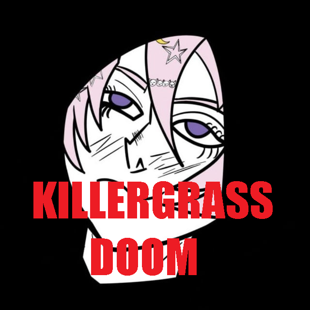
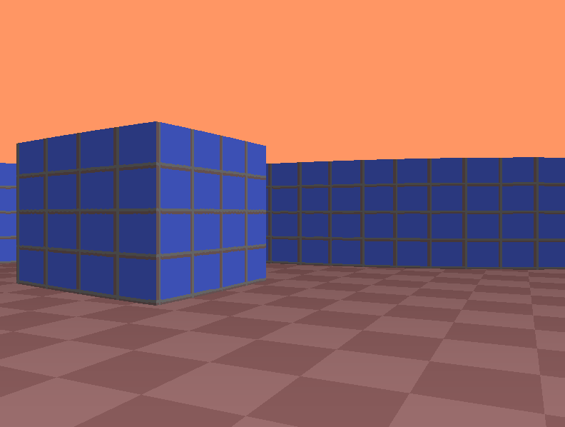
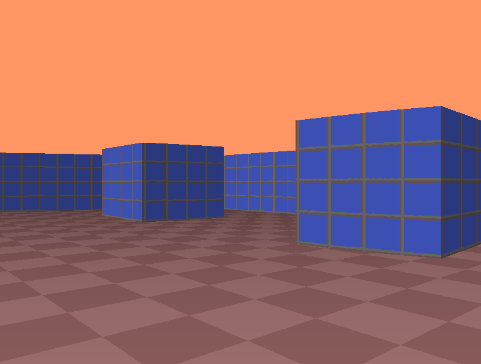
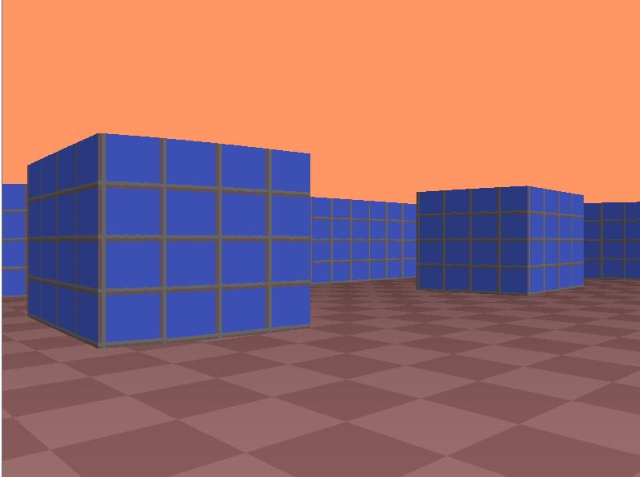

# KillerGrass DOOM


[](README_ru.md)

<div align="center">

</div>

# Educational minimal parody DOOM

This is a minimal educational parody of DOOM with Ray Casting and BSP functions. This game is written for educational purposes in pure C++ only under Windows. 

# Installing

To use the game you need to install `g++` and have Windows7/8/10 (or any where you can install g++). The authors use `g++` version `14.2.0`.

Clone repository:

```bash
git clone https://github.com/UbicaTravy/KillerGrassDOOM
```

For build executable file run the build.bat file or use `Makefile`:

```bash
make
```

Done! The file `killer_grass_doom.exe` will appear in your folder!

Building relise:

```bash
windres resources.rc -o resources.o
g++ -O3 -Wall -Wextra -static -mwindows -o killer_grass_doom.exe main.o game.o render.o trig_tables.o resources.o -lgdi32 -lwinmm
```

In `file resourses.rc` path to icon

```
MAINICON ICON "img/icon.ico"
```

# Game process

`WASD` - move

Arrows - camera

# Useful links

[Ray Casting](https://lodev.org/cgtutor/raycasting.html)

[BSP](https://ru.wikipedia.org/wiki/%D0%94%D0%B2%D0%BE%D0%B8%D1%87%D0%BD%D0%BE%D0%B5_%D1%80%D0%B0%D0%B7%D0%B1%D0%B8%D0%B5%D0%BD%D0%B8%D0%B5_%D0%BF%D1%80%D0%BE%D1%81%D1%82%D1%80%D0%B0%D0%BD%D1%81%D1%82%D0%B2%D0%B0)

# Bags now

Floor rendering is a bit lame, we are working on this bug at the moment. If you want to help and know how - write to me!

# Screenshots from game

<div align="center">





</div>

# License

[](LICENSE)

<div align="center">

### Created by KillerGrass

 

[](https://github.com/UbicaTravy)

[](https://t.me/killergrass_programms)

[](https://t.me/kanal_kashkamalhika)

</div>

<div align="center">

## Contacts

[](https://t.me/killer_grass1834)
[](mailto:killergrasscontact@gmail.com)
</div>