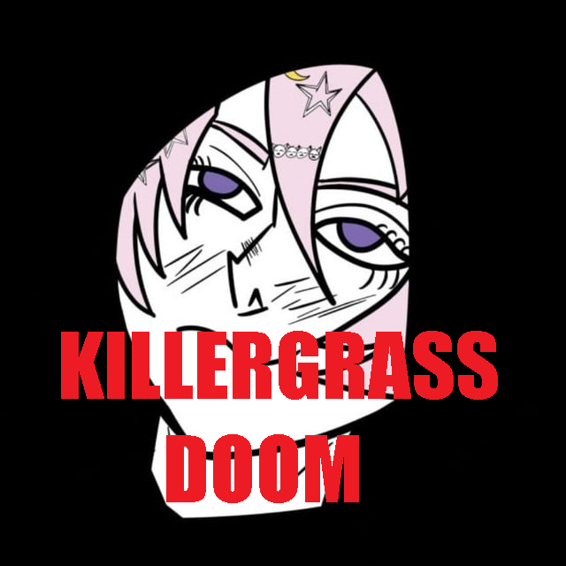
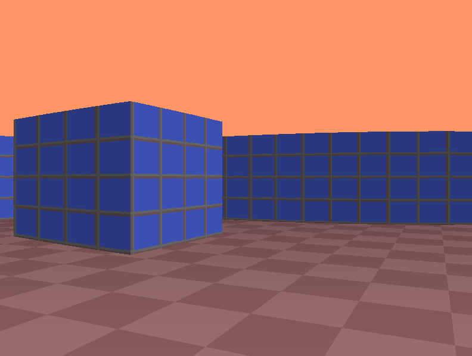
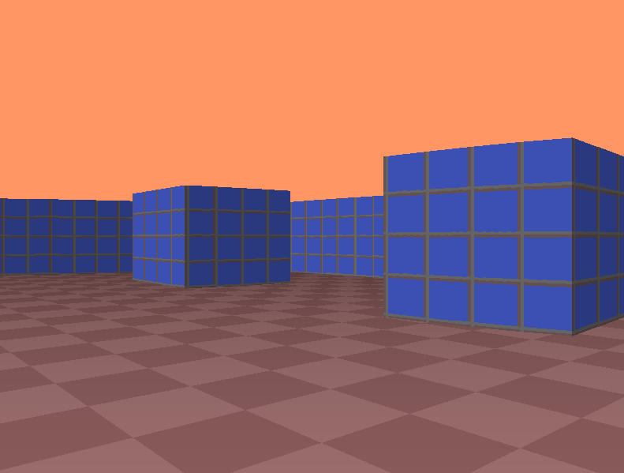
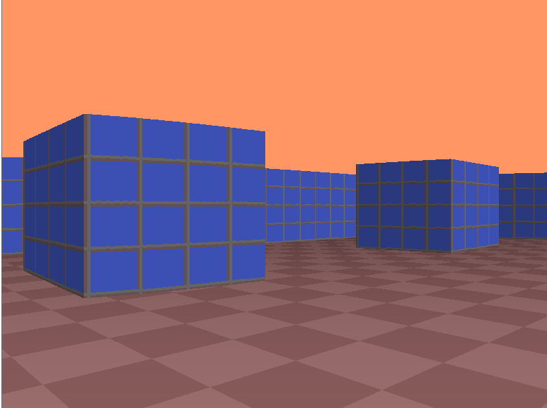

# KillerGrass DOOM


Это README на русском

[](README_ru.md)

<div align="center">

</div>

# Минимальная образовательная пародия на DOOM

Это минималистичная образовательная пародия на DOOM с Ray Casting и функциями BSP. Игра написана в образовательных целях на чистом C++ только под Windows.

# Установка

Для игры вам потребуется установленный `g++` и Windows 7/8/10 (или любой другой, где можно установить g++). Авторы используют `g++` версии `14.2.0`.

Склонируйте репозиторий:

```bash
git clone https://github.com/UbicaTravy/KillerGrassDOOM
```

Для сборки исполняемого файла запустите файл build.bat или используйте `Makefile`:

```bash
make
```

Готово! Файл `killer_grass_doom.exe` появится в вашей папке!

## Постройка релиза:

```bash
windres resources.rc -o resources.o
g++ -O3 -Wall -Wextra -static -mwindows -o killer_grass_doom.exe main.o game.o render.o trig_tables.o resources.o -lgdi32 -lwinmm
```

В файле `resourses.rc` путь к значку

```
MAINICON ICON "img/icon.ico"
```

# Игровой процесс

`WASD` — движение

Стрелки — камера

# Полезные ссылки

[Ray Casting](https://lodev.org/cgtutor/raycasting.html)

[BSP](https://ru.wikipedia.org/wiki/%D0%94%D0%B2%D0%BE%D0%B8%D1%87%D0%BD%D0%BE%D0%B5_%D1%80%D0%B0%D0%B7%D0%B1%D0%B8%D0%B5%D0%BD%D0%B8%D0%B5_%D0%BF%D1%80%D0%BE%D1%81%D1%82%D1%80%D0%B0%D0%BD%D1%81%D1%82%D0%B2%D0%B0)

# Баги сейчас

Рендеринг пола немного хромает, мы сейчас работаем над этой ошибкой. Если хотите помочь и знаете как — напишите мне!

# Скриншоты из игры

<div align="center">





</div>

# Лицензия

[](LICENSE)

<div align="center">

### Created by KillerGrass

 

[](https://github.com/UbicaTravy)

[](https://t.me/killergrass_programms)

[](https://t.me/kanal_kashkamalhika)

</div>

<div align="center">

## Contacts

[](https://t.me/killer_grass1834)
[](mailto:killergrasscontact@gmail.com)
</div>